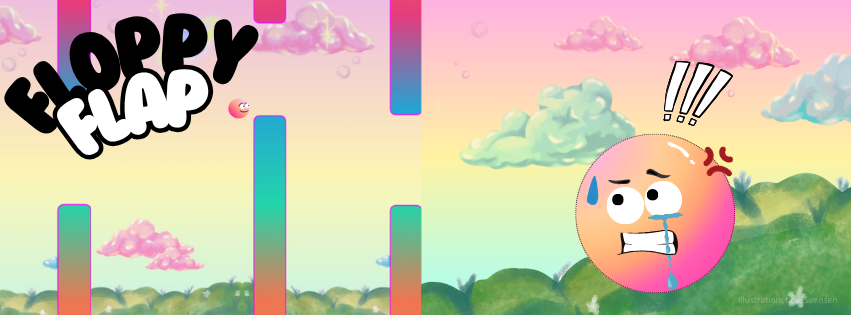
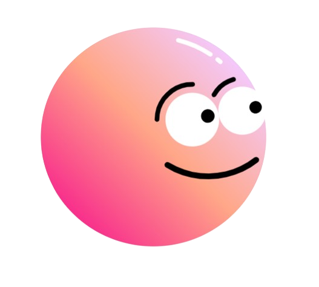

<p align="center">
    
</p>

#  Floppy Flap - The Game 

<p align="center">
  
</p>

## 📖 Description

This is a game made from scratch using React, Tailwind, and Vite. Help the little creature named Flob "flap" (jump) through the skies without hitting the pipes. How far can you go? Can you beat your last record? Inspired by the beloved and now-retired mobile game, Flappy Bird.

As the first complete game I've created, it's been a lot of fun watching it come together. Future plans include setting up a backend to support a public high score list. I'm open to adding more obstacles and challenges to make the game even more engaging.

---

## 📋 Table of Contents

- [Features](#features)
- [Folder Structure](#folder-structure)
- [Technologies Used](#technologies-used)
- [Setup & Installation](#setup--installation)
- [Usage](#usage)
- [Credits](#credits)
- [License](#license)

---

## 🌟 Features

-  Mobile screen support (360px and up)
-  Desktop screen layout
-  Live score tracking
-  Game-Over score display
-  Highest score saved locally
-  Animated rainbow pipes
-  Intro and Game-Over screens
-  Lottie character animation (shoutout to Chael Dale)

---

## 📁 Folder Structure

```bash
📦 Floppy-Flap
├── public/
├── src/
│   ├── assets/
│   ├──App.jsx
│   ├──CanvasGame.jsx
│   ├──CanvasGameDesktop.jsx
│   ├──index.css
│   ├──main.jsx
│   ├──ResponsiveGame.jsx
├── index.html
├── tailwind.config.js
├── vite.config.js
├── package.json
├── package-lock.json
└── README.md
```

---

## ⚙️ Technologies Used

- **React 19**
- **Tailwind CSS**
- **Vite**
- **Lottie**

---

## 🚀 Setup & Installation

```bash
git clone https://github.com/yourusername/Floppy-Flap.git
cd Floppy-Flap

npm install

npm run dev        # Starts local dev server
npm run build      # Production build
Access locally at http://localhost:5173
```

## 💡 Usage

Press SPACE to jump. On mobile, tap screen. Dont hit the pipes!

## 🙌 Credits

Author: Line Svensen (me)

Design: Tailwind CSS

Animations: Lottie

## 📄 License

This project is open-source and available under the [MIT License](LICENSE).
